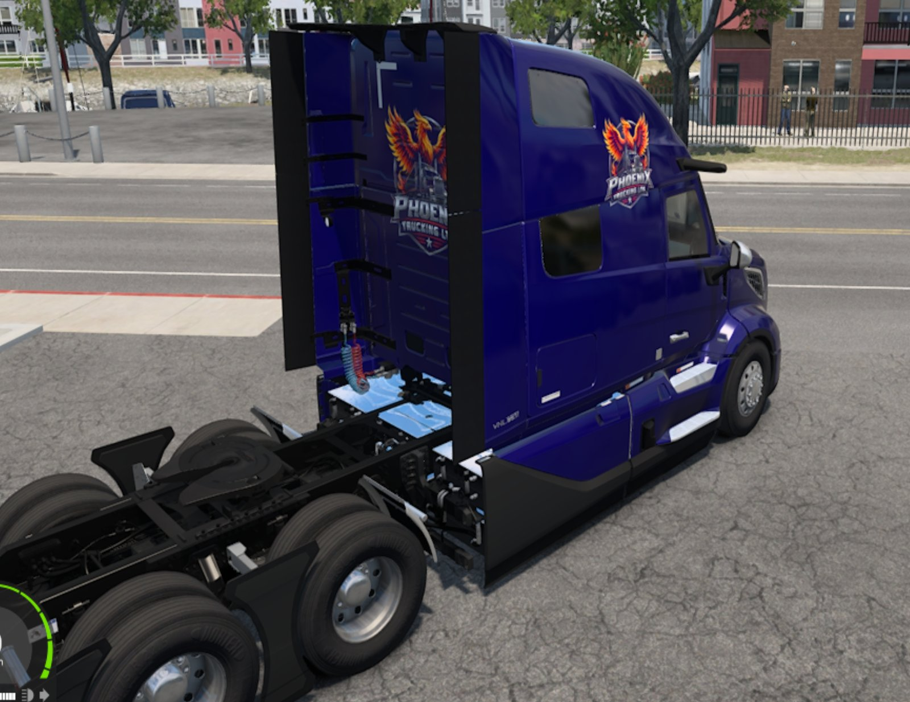

# ATS-Mods for Electric Trucking



Mods for **American Truck Simulator 1.61**, generated by scripts. The repo holds only our own sources; everything
derived from SCS game files (extracted defs, converted/compiled models, built `.scs` packages) is created locally
and ignored by git.

| Folder | Mod / tool | Output |
|---|---|---|
| [`vnl_electric`](vnl_electric/README.md) | Volvo VNL Electric: VNL 2025 on electrified frames, VNR battery packs + centre pack, e-axles 460/920 kW, "Phoenix Trucking" paint | `vnl_electric_concept.scs` |
| [`ev_chargers`](ev_chargers/README.md) | finds every EV charger on the map (base + all owned state DLCs) -> `data/chargers.csv`; plug icon on the world map; refuel spots beside every charger (drive in, full charge) | `ev_chargers.scs` |
| `kenworth_phoenix` | "Phoenix Trucking" paint job (white metallic + logo) for the Kenworth T680 (2014) | `kenworth_phoenix.scs` |

---

## 1. Setup (once)

### 1.1 Tools
| Tool | Version | Where it must be | Get it |
|---|---|---|---|
| American Truck Simulator | 1.61 + DLCs *Volvo VNL (2025)* and *Ownable Volvo VNR Electric* mod | Steam | |
| Python | 3.12+ | on PATH | python.org |
| Pillow | see `requirements.txt` | `pip install -r requirements.txt` | |
| SCS Extractor | the game's `scs_extractor.exe` (if present) or [sk-zk/Extractor](https://github.com/sk-zk/Extractor/releases) | game folder / any folder | the website version cannot read HashFS v2 |
| ConverterPIX | latest | `vnl_electric\tools\bin\converter_pix.exe` | https://github.com/mwl4/ConverterPIX/raw/master/bin/win_x64/converter_pix.exe |
| SCS Conversion Tools | latest | `C:\ATSExtract\conversion_tools` | https://download.eurotrucksimulator2.com/conversion_tools_2_21.zip (newest on modding.scssoft.com > Tools > Conversion Tools) |
| .NET SDK | 8 or newer | on PATH | dotnet.microsoft.com (only for `ev_chargers/ChargerFinder`) |
| Blender 3.6 + SCS Blender Tools | optional | | only for `vnl_electric/tools/inspect_models.py` |

```powershell
pip install -r requirements.txt
New-Item -ItemType Directory -Force vnl_electric\tools\bin
Invoke-WebRequest https://github.com/mwl4/ConverterPIX/raw/master/bin/win_x64/converter_pix.exe -OutFile vnl_electric\tools\bin\converter_pix.exe
```

### 1.2 Extract the game data to `C:\ATSExtract`
All scripts default to `C:\ATSExtract` (override with `--game` / `--conv` where offered). The extractor needs the
target folder to exist. Extract into the **same** folder, base first, DLCs on top:
```powershell
$g = "C:\Program Files (x86)\Steam\steamapps\common\American Truck Simulator"
New-Item -ItemType Directory -Force C:\ATSExtract | Out-Null
foreach ($a in "def", "dlc_volvo_vnl2025", "dlc_volvo_vnr_e") { & "$g\scs_extractor.exe" "$g\$a.scs" C:\ATSExtract }
# without scs_extractor.exe in the game folder (sk-zk/Extractor):
# extractor.exe "$g\def.scs" "$g\dlc_volvo_vnl2025.scs" "$g\dlc_volvo_vnr_e.scs" --deep -d C:\ATSExtract
```
Set `$g` to your game folder (for example `D:\SteamLibrary\steamapps\common\American Truck Simulator`).
Result: `C:\ATSExtract\def\vehicle\truck\volvo.vnl2025`, `...\volvo.vnr_e`, `C:\ATSExtract\vehicle\truck\volvo_vnl2025`, `...\volvo_vnr_e`.

Only for `ev_chargers` (map of the base game and every installed state DLC, about 1 GB) - one folder for all of them:
```powershell
python ev_chargers\extract_maps.py --game $g --extractor <path to extractor.exe>   # -> C:\ATSExtract\map_all + sector_source.csv
```
Run it again after buying another state DLC or after an ATS map update.

### 1.3 Conversion tools
Unzip the SCS Conversion Tools to `C:\ATSExtract\conversion_tools`. The build scripts create the junctions
`conversion_tools\rsrc\vnl_e` / `rsrc\ev_chargers` to their project folders themselves and read the results from
`conversion_tools\rsrc\rsrc\<name>\@cache`.

---

## 2. Build

### VNL Electric
```powershell
cd vnl_electric\tools
python build_models.py        # only after changing models, battery sizes, motors layout or the logo/paint
python make_vnl_electric.py --game C:\ATSExtract --donor volvo.vnl2025 --pack
```
- `build_models.py` (several minutes): frames without step ladder, 27 battery packs (Standard/ER/XR per frame) with
  centre pack and e-axle units, paint masks with `assets\logo.jpg` -> `vnl_electric\vehicle`, `vnl_electric\automat`.
- `make_vnl_electric.py --pack`: definitions -> `vnl_electric\def`, packs `ATS-Mods\vnl_electric_concept.scs`, and
  copies it to `Documents\American Truck Simulator\mod` (OneDrive Documents first). If ATS is running the copy is
  skipped with a warning - close ATS and run again.
- `make_vnl_electric.py ... --workshop [dir]` (implies `--pack`): also writes the Steam Workshop Uploader input to
  `ATS-Mods\workshop` (or `dir`): `vnl_electric\` = the mod folder to select in the uploader (root: only `versions.sii` + `universal\`, which holds `manifest.sii`, `description.txt`, `mod_icon.jpg` and the content), `preview.jpg` =
  640x360 Workshop preview image. Upload with *American Truck Simulator - Workshop Uploader* (Steam > Library > Tools).
- Log: `vnl_electric\build_log.txt`.

### Phoenix Trucking for the Kenworth T680 (2014)
```powershell
python kenworth_phoenix\make_kenworth_phoenix.py      # needs dlc_kenworth_t680.scs extracted to C:\ATSExtract
```
Projects `vnl_electric\assets\logo.jpg` onto the 76" hi-rise and 52" mid-roof sleepers (sides + back, kept off all windows;
plain white on the day cab), compiles the masks with the conversion tools, packs and installs
`kenworth_phoenix.scs`. Rerun after changing the logo.

### EV chargers
```powershell
cd ev_chargers\ev_marker; python build_ev_marker.py          # marker model + icon (wipes ev_marker\mod)
cd ..\ChargerFinder; dotnet run --place --fuel-test all     # -> data\chargers.csv, plug icons, refuel spots at every charger
cd ..\ev_marker; python package_ev_marker.py                 # -> ev_chargers.scs, installed to the mod folder
```
Add `--workshop` to `package_ev_marker.py` to also write `ATS-Mods\workshop\ev_chargers\` (uploader folder, same
`versions.sii` + `universal\` layout as the VNL) and `workshop\ev_chargers_preview.jpg`. Note: the Workshop Uploader
rejects the map sector files (`.base/.data/.aux/.snd/.desc`, "unsupported extension"), so the full EV Chargers mod
cannot currently be uploaded; distribute `ev_chargers.scs` directly instead (attached to the GitHub release, linked from
the VNL description: https://github.com/barnstee/ATS-Mods/releases/latest/download/ev_chargers.scs). For the Workshop VNL build
use `make_vnl_electric.py --game C:\ATSExtract --donor volvo.vnl2025 --pump-charging --workshop` so it charges at pumps.
`--place` (map icons, **experimental**) writes the plug icons into ONE extra sector (`map/usa/sec-0040-0030.*`); no SCS sector is replaced (re-saving SCS sectors with TruckLib 0.5.1 crashed ATS 1.61). Keep the order above: `build_ev_marker.py` clears `ev_marker\mod`. If a save does not load, build without `--place`.

---

## 3. Play / test
1. ATS > Mod Manager: enable **Volvo VNL Electric** and **EV Chargers** (EV Chargers above other map mods).
   Chargers show a green plug on the world map (`ev_chargers/data/chargers.csv` lists them). Drive into a bay beside the charger
   and refuel like at a pump (full charge); needs the VNL built with `make_vnl_electric.py ... --pump-charging`.
2. Volvo dealer: VNL Electric. Kenworth T680 (2014): paint job "Phoenix Trucking" in the truck upgrade shop.
    Use a newly bought truck after rebuilding (old saves may keep removed parts).
3. Problems: `Documents\American Truck Simulator\game.log.txt` (search for `vnl_e`, `<ERROR>`).

## Repository layout
```
vnl_electric/  tools/ (scripts)  assets/logo.jpg  manifest.sii  description.txt
ev_chargers/   extract_maps.py  ChargerFinder/ (.NET)  ev_marker/ (scripts)  data/chargers.csv
```
Generated, not committed: `vnl_electric/{def,vehicle,automat,blender}/`, `build_log.txt`, `tools/bin/`, `ev_marker/{project,mod}/`, `*.scs`.

## License
Scripts: MIT (see LICENSE). Game assets used by the mods belong to SCS Software and are not included.
